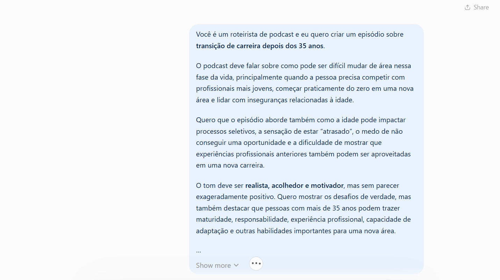
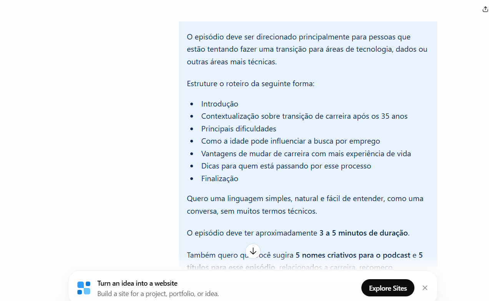

# 🎙️ Recalculando a Rota

Podcast criado como projeto da DIO, utilizando ferramentas de Inteligência Artificial para desenvolver um episódio sobre transição de carreira após os 35 anos.

---

## 🎧 Episódio 01

### Mudar de carreira depois dos 35: tarde demais?

**Tema:** Transição de carreira após os 35 anos  
**Categoria:** Carreira • Tecnologia • Recomeço  
**Formato:** Episódio solo  
**Duração:** aproximadamente 4 minutos e 30 segundos

---

## 💡 Sobre o projeto

O projeto **Recalculando a Rota** foi desenvolvido com o objetivo de explorar o uso de Inteligência Artificial na criação de conteúdo digital.

A proposta foi criar um episódio de podcast passando por diferentes etapas, desde a definição do tema e estruturação do roteiro até a geração da voz, edição do áudio e criação da identidade visual.

O primeiro episódio fala sobre os desafios de mudar de carreira depois dos 35 anos, principalmente para áreas como tecnologia e dados.

A ideia foi abordar de forma realista questões como insegurança, competição com profissionais mais jovens, sensação de estar começando do zero e dificuldades nos processos seletivos, mas também destacar como experiências profissionais anteriores, maturidade, responsabilidade e capacidade de adaptação podem ser vantagens durante uma transição de carreira.

---

## 🤖 Processo de criação com IA

O desenvolvimento do projeto foi dividido nas seguintes etapas:

1. Definição do tema do episódio
2. Definição do público-alvo
3. Criação dos prompts
4. Estruturação do roteiro com apoio do ChatGPT
5. Refinamento do texto
6. Geração da voz com ElevenLabs
7. Edição do áudio no CapCut
8. Criação da identidade visual
9. Organização do projeto no Notion
10. Documentação e publicação no GitHub

---

## 💬 Prompts utilizados

Para desenvolver o roteiro, foram utilizados prompts detalhados no ChatGPT, definindo tema, público, estrutura, linguagem, duração e tom do episódio.

### Prompt 1 — Tema, público e direcionamento

Neste primeiro prompt foram definidos:

- o tema de transição de carreira depois dos 35 anos;
- os desafios de começar em uma nova área;
- a competição com profissionais mais jovens;
- inseguranças relacionadas à idade;
- dificuldades em processos seletivos;
- aproveitamento das experiências profissionais anteriores;
- público interessado em tecnologia, dados e áreas mais técnicas;
- tom realista, acolhedor e motivador.

---

### Prompt 2 — Estrutura do episódio

No segundo prompt, foi definida a estrutura do episódio:

- Introdução
- Contextualização sobre transição de carreira após os 35 anos
- Principais dificuldades
- Como a idade pode influenciar a busca por emprego
- Vantagens de mudar de carreira com mais experiência de vida
- Dicas para quem está passando pelo processo
- Finalização

Também foi definido que o episódio deveria utilizar uma linguagem simples, natural e fácil de entender, com duração aproximada de 3 a 5 minutos.

---

## 🎨 Identidade visual

A identidade visual do podcast também foi desenvolvida com apoio de Inteligência Artificial.

A proposta foi criar uma imagem que representasse:

- uma mulher adulta em processo de transição de carreira;
- ambiente relacionado a tecnologia e estudo;
- computador;
- elementos de podcast;
- visual profissional;
- tons azul e roxo;
- expressão segura e determinada.

---

## 🎬 Resultado final

O episódio foi produzido com narração gerada por IA e posteriormente editado no CapCut.

### ▶️ Episódio 01

[Mudar de carreira depois dos 35: tarde demais?](Podcast_audio_under5MB.mp3)

**Duração:** aproximadamente 4min31s

---

## 🛠️ Ferramentas utilizadas

- **ChatGPT** — criação e refinamento dos prompts e do roteiro
- **ElevenLabs** — geração da voz
- **CapCut** — edição do áudio
- **Notion** — organização visual do projeto
- **GitHub** — documentação e publicação

---

## 🧠 Aprendizados

Durante o desenvolvimento deste projeto, foi possível explorar na prática como ferramentas de Inteligência Artificial podem ser utilizadas em diferentes etapas de criação de conteúdo.

Além do uso de IA, o projeto também envolveu:

- estruturação de ideias;
- criação de prompts;
- organização de roteiro;
- edição de áudio;
- criação de identidade visual;
- documentação de projeto;
- publicação no GitHub.

O projeto também mostrou como a IA pode funcionar como uma ferramenta de apoio durante o processo criativo, enquanto as decisões sobre tema, direcionamento, linguagem e resultado final continuam sendo conduzidas pelo criador do projeto.

---

## 👩‍💻 Autora

**Deborah dos Santos**

Projeto desenvolvido como parte de uma atividade da **DIO**.
